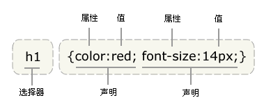
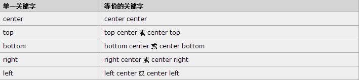
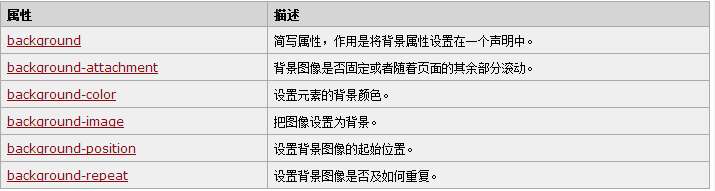

2015/1/6 星期二 10:17:39 
# 1. CSS 基础 #

## 1.1 CSS 概述 ##

 - CSS指层叠样式表(Cascading Style Sheets)
 - 样式定义**如何显示**HTML元素
 - 样式通常存储在**样式表**中
 - 把样式添加到 HTML4.0 中，是为了**解决内容与表现分离的问题**
 - **外部样式表**可以极大提高工作效率
 - 外部样式表通常存储在**CSS文件**中
 - 多个样式可**层叠**为一

**层叠次序**  
**当同一个 HTML 元素被不止一个样式定义时，会使用哪个样式呢？**  
一般而言，所有的样式会根据下面的规则层叠于一个新的**虚拟样式表**中，其中数字 4 拥有最高的优先权。  
1. 浏览器缺省设置。  
2. 外部样式表。  
3. 内部样式表(位于 <head> 标签内部)。  
4. 内联样式(在 HTML 元素内部)。

## 1.2 CSS 语法 ##

CSS规则由两个主要部分构成：**选择器**，以及**一条或多条声明**。  

    selector {declaration1;declaration2;...;declarationN}

**选择器通常是你需要改变样式的 HTML 元素。**  
**每条声明由一个属性和一个值组成。**  

属性(property)是希望设置的样式属性(stye attribute)。每个属性有一个值。属性与值被冒号分开。  

    selector {property:value}

## 1.3 CSS高级语法 ##

### 1.3.1 选择器分组 ###

可以对选择器进行分组。这样，被分组的选择器就可以分享相同的声明。**用逗号将需要分组的选择器分开。**  

    h1,h2,h3,h4,h5,h6{
		color:green;
	}

### 1.3.2 继承及其问题 ###

根据 CSS，子元素从父元素继承属性。  
通过 CSS 继承，子元素将继承最高级元素所拥有的属性。

## 1.4 CSS 派生选择器 ##

**派生选择器：**通过依据元素在其位置的上下文关系来定义样式，可以使标记更加简洁。  
在 CSS1 中，通过这种方式来应用规则的选择器被称为上下文选择器 (contextual selectors)，这是由于它们依赖于上下文关系来应用或者避免某项规则。在 CSS2 中，它们称为派生选择器，但是无论你如何称呼它们，它们的作用都是相同的。  

派生选择器允许你根据文档的上下文关系来确定某个标签的样式。通过合理地使用派生选择器，我们可以使 HTML 代码变得更加整洁。  

**定义派生选择器实例：**

    li strong{
		font-style: italic;
		font-weight: normal;
	}

则，只有 li 元素中的 strong 元素的样式为斜体，无需为 strong 元素定义特别的 class 或 id。

## 1.5 CSS id 选择器 ##

**id 选择器：**可以为标有特定 id 的 HTML 元素指定特定的样式。  
**id 选择器以 “#” 来定义。**  

**定义 id 选择器实例**

    #red   {color: red;}
	#green {color: green;}

**id 属性只能在每个 HTML 文档中出现一次。**

## 1.6 CSS 类选择器 ##
	
在 CSS 中， 类选择器以一个**点号**显示：  

    .center {text-align: center;}

则，所有拥有 center 类的 HTML 元素均为居中。  

**类名的第一个字符不能使用数字。**  

和 id 选择器一样， class 也可以被用作派生选择器：  

    .fancy td{
		color: #600;
		background: #666;
	}
则，类名为 fancy 的更大的元素内部的表格单元都会以灰色背景显示橙色文字。  

**元素也可以基于它们的类而被选择：**

    td.fancy{
		color: #600;
		background: #666;
	}
类名为 fancy 的表格单元将是带有灰色背景的橙色。

## 1.7 CSS 属性选择器 ##

**对带有指定属性的 HTML 元素设置样式。**  
可以为拥有指定属性的 HTML 元素设置样式，而不仅限于 class 和 id 属性。

# 2. CSS 样式 #

## 2.1 CSS 背景 ##

**CSS 允许应用纯色作为背景，也允许使用背景图像创建复杂的效果。**  
CSS 在这方面的能力远在 HTML 之上。  

### 2.1.1 背景色 ###

使用 *background-color 属性* 为元素设置背景。该属性接受任何合法的颜色值。 

    p {background-color: gray;}
 
如果希望背景**从元素中的文本向外稍有延伸，只需增加一些内边距：**

    p {background-color: gray; padding : 20px;}

可以为所有元素设置背景色。background-color 不能继承，其默认值为 *transparent.*

### 2.1.2 背景图像 ###

要把图像放入背景，使用 *background-image 属性*。 该属性的默认值是 *none*, 表示背景上没放任何图像。  
如果要设置一个背景图像，必须为这个属性设置一个 URL 值：

    body {background-image : url;}

### 2.1.3 背景重复 ###

如需在页面上对背景图像进行平铺，可以使用 *background-repeat 属性。*  
属性值 repeat 导致图像在水平垂直方向上都平铺。 *repeat-x* 和 *repeat-y* 分别导致图像只在水平或垂直方向上重复， *no-repeat* 则不允许图像在任何方向上平铺。  

默认的，背景图像将从一个元素的左上角开始。  

### 2.1.4 背景定位 ###

利用 *background-position 属性* 改变图像在背景中的位置。  

**实例：**  

    body{
		background-image:url;
		background-repeat: no-repeat;
		background-position: center;
	}

为 background-position 属性提供值有很多方法。首先，可以使用一些关键字：top、bottom、left、right 和 center。通常，这些关键字会成对出现，不过也不总是这样。还可以使用长度值，如 100px 或 5cm，最后也可以使用百分数值。不同类型的值对于背景图像的放置稍有差异。

### 2.1.5  关键字 ###

图像放置关键字最容易理解，其作用如其名称所表明的。例如，top right 使图像放置在元素内边距区的右上角。

根据规范：**位置关键字可以按任何顺序出现，只要保证不超过两个关键字。一个对应水平方向，另一个对应垂直方向。**  
如果只出现一个关键之，则认为**另一个关键字是 center.**

### 2.1.6 百分数值 ###

### 2.1.7 长度值 ###

**长度值解释的是元素内边距区左上角的偏移。偏移点是图像的左上角。**

### 2.1.8 背景关联 ###

如果文档比较长，那么当文档向下滚动时，背景图像也会随之滚动。当文档滚动到超过图像的位置时，图像就会消失。  
可以通过 *background-attachment 属性* 防止这种滚动。通过该属性，可以声明图像相对于可视区是固定的(fixed)，因此不会收滚动影响：  

    body {
		background-image:url(/i/eg_bg_02.gif);
		background-repeat:no-repeat;
		background-attachment:fixed
	}

background-attachment 属性的默认值是 scroll，也就是说，在默认的情况下，背景会随文档滚动。

**CSS 背景属性**

## 2.2 CSS 文本 ##

**CSS 文本属性可定义文本的外观。**  
通过文本属性，可以改变文本的颜色、字符间距、对齐文本、装饰文本、对文本进行缩进，等等。

### 2.2.1 缩进文本 ###

使用 *text-indent 属性*，可以方便地实现文本缩进。  
通过使用 text-indent 属性，所有元素的第一行都可以缩进一个给定的长度，甚至该长度可以是负值。

**无法将该属性应用于行内元素，图像之类的替换元素上也无法应用 text-indent 属性。不过，如果一个块级元素（比如段落）的首行中有一个图像，它会随该行的其余文本移动。**