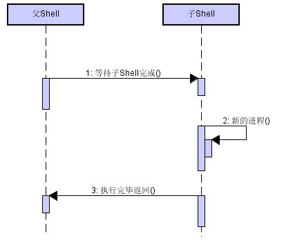

# Shell 学习笔记 #
  
*UNIX* 在 1970 年发布第一个版本，由贝尔实验室开发。  
  
> 在 *UNIX* 系统中，常将主内存 *main memory* 称为核心 *core* , 而核心映像 *core image* 就是进程 *process* 执行当时的内存内容。当进程发生错误或是收到信号 *signal* 而终止执行时，系统会将核心映像写入一个文件，以作为调试之用，这就是所谓的核心转储 *core dump* 。  

## 入门 ##
  
*Shell* 脚本最常用于系统管理工作，或是 用于结合现有的程序以完成小型的、特定的工作。一旦找出完成工作的方法，可以把用到的命令串在一起，放在一个独立的程序或是脚本里，伺候只要直接运行该程序便能完成工作。    
  
使用 *Shell* 的原因：  
1. 简单性： *Shell* 是一个高级语言，通过它可以简洁地表达复杂的操作。  
2. 可移植性： 使用 *POSIX* 所定义的功能，可以做到脚本无需修改就可以在不同的系统上执行。  
3. 开发容易： 可以在短时间内完成一个功能强大而又好用的脚本。  

### 第一行的 #！ ###
  
当 *Shell* 执行一个程序时，会要求 *UNIX* 内核启动一个新的进程，以便在该进程里执行所指定的程序。  
  
脚本文件中，在第一行的开头出使用 `#！` 这两个字符。当一个文件中开头的两个字符是 `#!` 时，内核会扫描该行其余的部分，看是否存在可用来执行程序的解释器的完整路径。中间出现的任何空白符号都会略过。此外，内核还会扫描是否有一个选项要传递给解释器。内核会以指定的选项来引用解释器，再搭配命令行的其他部分。  
  
### Shell 基本元素 ###
  
#### 命令与参数 ####
  
*Shell* 最基本的工作就是执行命令。**Shell三种基本命令：内建命令、Shell函数以及外部命令。**
* 内建命令就是由 *Shell* 本身所执行的命令。  
* *Shell* 函数的功能健全的一些列程序代码，以 *Shell* 语言编写而成，可以像命令那样引用。  
* 外部命令就是由 *Shell* 的副本(新的进程)所执行的命令。基本的过程如下：  
	1. 建立一个新的进程。此进程即为 *Shell* 的一个副本。  
	2. 在新的进程里，在 *PATH* 变量内所列出的目录中，寻找特定的命令。当命令名称含有斜杠(/)符号时，将略过路径查找步骤。  
	3. 在新的进程里，以所找到的新程序取代执行中的 *Shell* 程序并执行。  
	4. 程序完成后吗，最初的 *Shell* 会接着从终端读取下一条命令，或执行脚本里的下一条命令。  
	  

<center>
  
</center>
  
#### 变量 ####
  
变量就是为某个信息片段所起的名字。*Shell* 变量名称的开头是一个字母或下划线，后面可以接着任意长度的字母、数字或下划线。变量名称的长度并无限制。*Shell* 变量可用来保存字符串值，所能保存的字符数同样没有限制。  
变量赋值的方法是：先写变量名称、紧接着 `=` 符号，最后是新值， **中间完全没有空格。**
取出*Shell*变量的值时，需要在变量名称前面加上 `$` 字符。  
**所赋值的内容包含空格时，需要加上引号。**  
  
#### echo 输出 ####
  
`echo` 的任务就是产生输出，用来提示用户，或是用来产生数据供进一步处理。  
原始的 `echo` 命令只会将参数打印到标准输出，参数之间以一个空格隔开，并以换行符 *newline* 结尾。  
  
#### 基本的 I/O 重定向 ####
  
**重定向与管道**  
*Shell* 提供了数种标记语法，用来改变默认 `I/O` 的来源端与目标端。  
1. 以 `<` 改变标准输入。  
2. 以 `>` 改变标准输出。  `>` 重定向符在目标文件不存在时，会新建一个。然而，如果目标文件存在，就会被覆盖掉，**原本的数据都会丢失。**  
3. 以 `>>` 附加到文本。如果你目标文件不存在，就会新建一个。如果目标文件已经存在，他不会直接覆盖，而是将程序所产生的数据附加到文件结尾处。  
4. 以 `|` 建立管道。`program1 | program2` 将 `program1` 的标准输出作为 `programe2` 的标准输入。  

重定向符可以 **将输入与输出连接到到文件**， 管道可以 **把两个以上执行中的程序衔接在一起。** 第一个程序的标准输出可以变成第二个程序的标准输入。  
**使用管道的好处在于，管道可以使程序执行速度比使用临时文件的程序快。**  
  
**特殊文件**  
*UNIX* 提供了两个对 *Shell* 编程特别有用的特殊文件。第一个文件 `/dev/null`,传送到此文件的数据都会被系统丢掉。也就是说，当程序将数据写到此文件时，会认为它已经成功完成写入数据的操作，但实际上什么都没有做。当需要的是命令的退出状态，而非它的输出，次功能会很有用。相对的，读取 `/dev/null` 则会立即返回文件结束符(*end-of-file*)。  
另一个特殊文件为 `/dev/tty` 。当程序打开次文件时，*UNIX*会自动将它重定向到一个终端再与程序结合。这在程序必须读取人工输入时特别有用。  
`stty` 命令用来控制终端的各种设置。  
  
#### 基本命令查找 ####
  
*$PATH* 是一个以冒号分割的目录列表，可以在列表所指定的目录中查找所要执行的命令。所查找的命令可能是编译后的可执行文件，也可能是 *Shell* 脚本。从用户的角度来看，两者并无不同。  
*$PATH* 里的空项目表示当前目录。空项目在路径值中间时，用两个连续的冒号来表示。如果将冒号直接置于最前端或最尾端，可以分别表示查找时最先查找或最后查找当前目录。  
  
### 访问Shell脚本的参数 ###
  
所谓的位置参数 *positional parameters* 指的就是 *Shell* 脚本的命令行参数 *command-line arguments* 。在*Shell* 程序里，它，们同时也可以是函数的参数。各参数都由整数来命名。基于历史的原因，**当它超过 9 时，应该用花括号把数字框起来。**  
  
```Shell
	echo first arg is $1
	echo tenth arg is ${10}
```  
  
此外，通过特殊变量，还可以取得参数的总数，以及一次取得所有参数。  
  
### 简单的执行跟踪 ###
  
当想知道程序正在做什么，可以把执行跟踪 *execution tracing* 的功能打开。这会使得 *Shell* 显示每个被执行到的命令，并在前面加上 `+`:一个加号后面跟一个空格。可以在脚本里，用 `set -x` 命令将执行跟踪的功能打开，然后用 `set +x` 命令关闭它。  
   
  
## 变量、判断、循环 ##
   
### 变量与算术 ###
  
*Shell* 变量如同传统程序语言非变量一样，用来保存某个值，之道需要它们为止。  
  
#### 变量赋值与环境 ####
  
有两个变量提供**变量的管理**。一个是 `readonly` 可以将变量变为只读模式，而赋值给它们是被禁止的。  
```Shell
	hours_per_day=24
	readonly hours_per_day
```  
一个是`export`，其用法是将变量放进环境*environment* 里。环境是一个名称与值的简单列表，可供所有执行中的程序使用。新的进程会从父进程继承环境，也可以在建立新的子进程之前修改它。  
  
> `export` 用于修改或打印环境变量。 `readonly` 用于使变量不可修改。  

`unset` 命令从执行中的 *Shell* 中删除变量或函数。默认情况下，它会解除变量设置。  
  
#### 参数展开 ####
  
参数展开 *parameter expansion* 是 *Shell* 提供变量值在程序中使用的过程。  
  
**展开运算符**  
第一组字符串处理运算符用来测量变量的存在状态，且为在某种情下允许默认值的替换。**替换运算符，**  
1. `${varname:-word}` --- 如果 *varname* 存在且不为 *null*，则返回其值；否则，返回 *word*。用途：如果变量未定义，则返回默认值。  
2. `${varname:=word}` --- 如果 *varname* 存在且不为 *null*，则返回其值；否则，设置它为 *word*,并返回其值。用途：如果变量未定义，则设置变量为默认值。  
3. `${varname:?message}` --- 如果 *varname* 存在且不为 *null*，则返回其值；否则，显示 *varname:message*,并退出当前的命令或脚本。省略 *message* 会出现默认信息 *parameter null or not set* 。用途：用于捕捉由于变量未定义所导致的错误。  
4. `${varname:+word}` --- 如果 *varname* 存在且不为 *null*，则返回 *word*。否则，返回 *null* 。用途：为测试变量存在。  

每个运算符内的冒号是可选的。如果省略冒号，则将每个定义中的 “存在部位 null”部分改为“存在”，也就是仅测试变量是否存在。  
  
**模式匹配运算符，**  
1. `${variable#pattern}` --- 如果模式匹配于变量值的开头处，则删除匹配的最短部分，并返回剩下的部分。  
2. `${variable##pattern}` --- 如果模式匹配于变量值的开头处，则删除匹配的最长部分，并返回剩下的部分。  
3. `${variable%pattern}` --- 如果模式匹配于变量值的结尾处，则删除匹配的最短部分，并返回剩下的部分。  
4. `${variable%%pattern}` --- 如果模式匹配于变量值的结尾处，则删除匹配的最长部分，并返回剩下的部分。  

*#* 匹配的是最前面，因为数字正负号总是置于数字之前； *%* 匹配的是后面，因为百分比符号总是跟在数字的后面。  
  
最后， `${#variable}` 返回 `$variable` 值里的字符长度。  
  
**位置参数**  
所谓位置参数 *positional parameter* 指的是 *Shell* 脚本的命令行参数。同时也表示在 *Shell* 函数内的函数参数。它们的名称以单个的整数来命名。  
**特殊变量：**  
* `$#` 表示传递到 *Shell* 脚本或函数的参数的总数。当为了处理选项和参数而建立循环时，会很有用。  
* `$*, $@` 一次表示所有的命令行参数。这两个参数可用来将命令行参数传递给脚本或函数所执行的程序。   
* `"$*"` 将所有命令行参数视为单个字符串。等同于 `"$1 $2 ..."`。   
* `"$@"` 将所有命令行参数视为单独的个体，也就是单独字符串。等同于 `"$1" "$2" ...` 。这是将参数传递给其他程序的最佳方式，因为它会保留所有内嵌在每个参数里的任何空白。  

`set` 命令可以用来做很多事。调用此命令而未给予任何选项，则会设置位置参数的值，并将之前存在的任何值丢弃。  
`shift` 命令用于“截去”来自列表的位置参数，由左开始。一旦执行 `shift`， `$1` 的初始值会永远消息，取而代之的是 `$2` 的旧值。而 `$2` 的值变为 `$3` 的旧值，以此类推。`$#` 值则会逐次减 1 。`shift` 也可以使用一个可选的参数，也就是位移的参数的计数。单纯的 `shift` 等同于 `shift 1` 。  
  
除了之前的特殊变量以外， *Shell* 还有很多额外的内置变量。有一些具有单一字符、非文字会数字字母的名称，其余的全是由大写字母组成的名称。  
  
* `#` --- 目前进程的参数个数。  
* `@` --- 传递给当前进程的命令行参数。置于双引号内，会展开为个别的参数。  
* `*` --- 当前进程的命令行参数。置于双引号内，展开为一单独参数。  
* `-` --- 连字号，在引用是给予 *Shell* 的选项。  
* `?` --- 前一个命令的退出状态。  
* `$` --- *Shell* 进程的进程编号 *process ID* 。  
* `0` --- *Shell* 进程的名称。  
* `!` --- 最近一个后台命令的进程编号。  
* `ENV` --- 一旦引用，则仅用于交互式 *Shell* 中， `$ENV` 的值是可展开的参数。结果应该为要读取和在启动时要执行的一个文件的完整路径名称。  
* `HOME` --- 根(登陆)目录。  
* `IFS` --- 内部的字段分割器。  
* `LANG` --- 当前 *locale* 的默认名称，其他的 `LC_*` 变量会覆盖其值。  
* `LC_ALL` --- 当前 *locale* 的名称，会覆盖 *LANG* 与其他 *LC_** 变量。  
* `LINENO` --- 刚执行过的行在脚本或函数内的行编号。  
* `PATH` --- 命令的查找路径。  
* `PPID` --- 父进程的进程编号。  
* `PS1` --- 主要的命令提示字符串。默认为 "$" 。  
* `PS2` --- 行继续的提示字符串。默认为 ">" 。  
* `PWD` --- 当前工作目录。  
  
### 退出状态 ###
  
每一条命令，不管是内置的、*Shell*函数，还是外部的。它退出时，都会返回一个小的整数值给引用它的程序，这就是程序的退出状态 *exit statu* 。  
  
#### 退出状态值 ####
  
一般来说，退出状态 0 表示成功。内置变量 `$?` 可以访问最近一次所执行的一个程序的退出状态。  
  
**POSIX的退出状态：**   
* 0 --- 命令成功退出。  
* 1 - 125 --- 命令不成功地退出。特定的退出值含义，是由各个单独的命令定义的。  
* 126 --- 命令找到了，但是文件无法执行。  
* 127 --- 命令找不到。  
* >128 --- 命令因收到信号而死亡。  

#### if-elif-else-fi 语句 ####
  
使用程序的退出状态，最简单的方式就是使用 `if` 语句。一般语法如下：  
```Shell  
	if pipeline
		[plpeline ...]
	then
		statements-if-true-1
	[elif pipeline 
		[pipeline...]
	then
		statements-if-true-2
	...]
	[else
		statements-if-all-else-fails]
	fi
```  
  
#### 逻辑的 NOT、AND、OR ####
  
* !  逻辑非。  
* && 逻辑与。  
* || 逻辑或。  

#### test命令 ####
  
*test* 命令可以处理 *Shell* 脚本里的各类工作。它产生的不是一般输出，而是可使用的退出状态。 `test` 接受各种不同的参数，可控制要执行哪一种测试。  
`test` 命令的另一种形式： **[...]**,这种用法的作用完全与 `test` 命令一样。例如，下面两个测试：  
```Shell
	if test "$str1" = "$str2"  
	if [ "$str1" = "$str2" ]
```  
**注意：**第二种形式方括号根据字面意义逐字输入，且必须与括起来的 *expression* 以空白隔开。  
  
**test 表达式：**  
* *string* --- *string* 不为 *null* 则为真。  
* *-b file* --- *file* 是块设备文件。  
* *-c file* --- *file* 是字符设备文件。  
* *-d file* --- *file* 是目录。  
* *-e file* --- *file* 存在。  
* *-f file* --- *file* 为一般文件。  
* *-g file* --- *file* 有设置它的 *setgid* 位。  
* *-h file* --- *file* 是以符号连接。  
* *-n file* --- *file* 是非 *null* 。  
* *-p file* --- *file* 是一命名的管道（FIFO文件）。  
* *-r file* --- *file* 是可读的。  
* *-S file* --- *file* 是 *socket* 。  
* *-s file* --- *file* 不是空的。  
* *-t n*    --- 文件描述符指向一终端。  
* *-u file* --- *file* 有设置 *setuid* 位。  
* *-w file* --- *file* 是可写入的。  
* *-x file* --- *file* 是可执行的，或 *file* 是可被查找的目录。  
* *-z string* --- *string* 为 *null* 。  
* *s1 = s2, s1 != s2* --- 字符串相等、不相等比较。  
* *n1 -eq n2, n1 -ne n2* --- 整数相等的比较。  
* *lt, gt, le, ge*  --- 大于，小于，大于或等于，小于或等于比较。 

### case 语句 ###
  
```Shell
	case $1 in
	-f）
		...
		;;
	-d | --directory)
		...
		;;
	*)
		...
		;;
	esac
```  
* 要测试的值出现在 *case* 和 *in* 之间。将值以双引号括起来虽非必须，但也无妨。  
* 根据 *Shell* 模式的列表依次测试，发现匹配的时候，便执行对应的程序代码，直到 `;;` 为止。  
* 可以使用多个模式，用 `|` 字符加以分割即可，这种情况为“或”。  
* 不对称的右圆括号。  
* `*` 模式是传统用法，是非必须的。作为一个默认的情况。  

### 循环 ###
  
#### for 循环 ####
  
`for` 循环用于重复整个对象列表，依次执行每一个独立对象的循环内容。对象可能是命令行参数、文件名或是任何可以以列表格式建立的东西。*for* 循环中的 *in* 列表是可选的，如果省略，*Shell* 会遍历整个命令行参数。`for i in "$@"` 。  
  
#### while 与 until 循环 ####
  
*Shell* 的 *while, until* 循环，与传统语言的循环类似。语法为：  
```Shell
	// while
	while condition
	do
		statements
	done

	// until
	until condition
	do
		statements
	done
```
  
对于 *if* 语句， *condition* 可以是简单的命令列表，或者是包含 `&&， ||` 的命令。  
`while` 与 `until` 的唯一的不同之处在于，如何对待 *condition* 的退出状态。只要 *condition* 是成功退出， `while` 会继续循环。只要 *condition* 未成功结束， `until` 则执行循环。  
  
`until` 用于等待某件事发生。  
  
#### break 和 continue ####
  
这两个命令分别用来退出循环，或跳到循环体的其他地方。  
`continue` 命令用于提早开始下一段重复的循环操作，也就是在到达循环体的底部之前。  
`break` 和 `continue` 命令都可以接受可选的数值参数，可分别用来支出要中断或继续多少个被包含的循环。如果循环计算需要的是一个在运行时可被计算的表达式时，可以使用 **$((...))** 。  
  
### 函数 ###
  
函数在使用之前必须先定义。函数被执行的方式与命令相同：提供函数名称与任何相对应的参数。在函数体中，位置参数 **($1, $2,  ..., $#, $@** 都是函数的参数。父脚本的参数则临时的被函数参数所掩盖或隐藏。**$0** 依然是父脚本的名称。当函数完成时，原来的命令行参数会恢复。  
在 *Shell* 函数里， `return` 命令的功能与工作方式都是与 `exit` 相同。  
需要注意的是：在 *Shell* 函数体里使用 `exit` 会终止整个 *Shell* 脚本。  
  
因为 `return` 语句会返回一个退出值给调用者，所以可以在 `if, while` 语句里使用函数。`return` 如果没有提供参数，则使用默认退出状态，也就是最后一个执行的命令的退出状态。如果这是想要的，较为严谨的函数写法为 `return $?` 。


## 查找与替换 ##
  
*Shell* 脚本时常用到的两个基本操作：文本查找，文本替换。  
  
### 查找文本 ###
  
