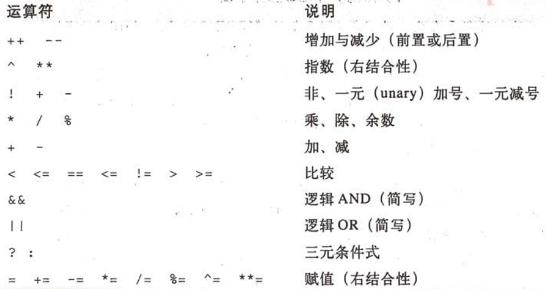

# AWK #
  
*AWK* 程序语言的设计是为了简化一般文本处理的工作。  
  
## AWK 命令行 ##
  
*awk* 的调用可以定义变量、提供程序并且指定输入文件：  
```awk
	awk [ -F fs ] [ -v var=value ... ] 'program' [ --] \
		[ var=value ... ] [ file[s] ]  
  
	awk [ -F fs ] [ -v var=value ... ] -f programfile [ --] \
		[ var=value ... ] [ file[s] ]
```  
  
短程序通常是直接在命令行上提供，而较长的程序，则通过 `-f` 选项指定。遇到需连接被指名的程序文件以得到完整的程序时，则可重复使用此选项。  
如果命令行没有指定文件名，则 `awk` 读取标注输入。  
`--` 是特殊选项：指出 `awk` 本身已没有更进一步的命令行选项。任何接下来的选项都可以被该程序使用。  
`-F` 选项是用来重新定义默认字段分隔符，一般惯例将其作为第一个命令行选项。紧接在 `-F` 选项后的 `fs` 参数是一个正则表达式，或是被提供作为下一个参数。字段分隔符也可是指使用 **内建变量 FS** 所指定的。  
  
## AWK 程序模型 ##
  
> *awk* 把输入流看做一连串记录的集合，每条记录都可进一步细分为字段。通常，一行一条记录，而字段则由一个或多个非空白字符的单词组成。  

注意：是什么构成一条记录和一个字段，完全是由程序员控制的，其 **它们的定义，甚至可以在处理期间更改。**  
  
一个 `awk` 程序是一对以 **模式** 与大括号框起来的 **操作** 组合而成的。还可以加上实现操作细节的 **函数** 。针对每个匹配与输入数据的模式，操作会被执行，且所有模式都会 **针对每条输入记录** 而检查。  
模式和操作可以省略其中一个。如果模式省略，则操作将会被应用到每条输入记录；如果操作被省略，则默认操作为将匹配的记录打印到标准输出。如下：  
```awk
	pattern { action }				// 如果模式匹配，则执行操作
	pattern							// 如果模式匹配，则打印记录
			{ action } 				// 针对每条记录，执行操作  
```  
输入会自动地由一个输入文件切换到下一个输入文件，且 `awk` 本身通常会处理每个输入文件的打开、读取和关闭，以允许用户程序专心致力于 **记录的处理。**  
模式多半是数字或字符串表达式，但是 `awk` 通过保留字 `BEGIN` 和 `END` 提供两种特殊的模式。  
* 与 `BEGIN` 关联的操作只会执行一次，在任何命令行文件或一般命令行赋值被处理之前，但是在任何开头的 `-v` 选项指定已经完成之后。它大多用于处理程序所需要的任何特殊初始化工作。  
* `END` 操作也是只执行一次，用于所有输入数据已被处理完之后。它多半用于产生摘要报告，或是执行清除操作。  
* `BEGIN, END` 模式可以是任意顺序的，可以存在于 `awk` 程序内的任何位置。为了方便，通常将 `BEGIN` 模式放在程序的第一个位置，而将 `END` 模式放在最后。  
* 当指定多个 `BEGIN, END` 模式时，将被按照在 `awk` 程序里的顺序，一次执行。  

## 程序元素 ##
  
`awk` 提供标量和数组两种变量来保存数据、数字和字符串，还提供一些语句类型用于处理数据：赋值、注释、条件、函数、输入、循环和输出。  
  
### 注释与空白 ###
  
`awk` 的注释从 `#` 开始到该行结束。  
语言里的任何地方都能有空白，也允许使用任何长度的空白字符。通过适当的使用空行与缩进，可以增进程序的可读性。  
单条语句通常不能被分割跨越多行，除非在行切割的地方立即前置一个反斜杠。   
  
### 字符串与字符串表达式 ###
  
`awk` 里的字符串常数以引号定界。字符串可以包含任何 *8-bit* 的字符，除了控制字符 *NUL* 以外。`awk` 字符串包含零至多个字符，且在字符串的长度上没有限制，视可用内存而定。字符串表达式赋值给变量后，会自动建立一个字符串，且变量的前一个字符串值所占用的内存也会被自动回收。  
反斜杠转义序列允许非打印字符的表示。  
`awk` 提供了许多方便好用的 **内建函数**，可在字符串上执行。  
字符串的比较，用得上传统的关系运算符: `==, !=, <, <=, >, >=` 。比较后返回 1 为真， 0 为假。比较不同长度的字符串，且其中一个字符串为另一个的初始子字符串时，较短的会定义为小于较长的那个。  
不同于大多数程序语言用于字符串数据类型：`awk` 并无特殊的字符串接续运算符。也就是说，两个连续字符串，会自动连接在一起。  
将数字转换为字符串，通过数字连接空字符串即可: `n = 123; s = "" n`, 把 123“ 赋给 `s`。当数字无法确切地表示时，会出现一些警告。  
`awk` 功能强大的地方大多来自于它对正则表达式的支持。有两个运算符 `~（匹配）` 与 `!~（不匹配）` 。  
  
### 数字与数值表达式 ###
  
所有 `awk` 里的数字，都以双精度的浮点值表示。浮点数可以包含一个末端以字母 *e,E* 所表示的 10 次方指数以及可选地带正负号的一个整数。`awk` 将字符串转换为数字：只要加个零到字符串里。例如：`s = "1234"` ,接着是 `n = 0 + s`，便将数字 1234 赋给 `n` 了。  
浮点数有精度限制，有些值无法准确表示：计算的次序很重要，且计算的结果通常只是尽可能地表示为最接近的数字。  
  
**awk 的数值运算符(优先级由大到小)**  
  
  
### 标量变量 ###
  
保存单一值的变量叫做标量。 **变量无须先进行声明。** 相反的，它会在程序里第一次使用它的时候自动被建立。通常是通过指定其值达成，该值可能是数字或是字符串。所有的 `awk` 变量在建立时其初始值为一个空字符创，但是当需要数值时，它会被视为零。变量名称在实际上没有长度限制。另外， `awk` 的变量名称是大小写敏感的。一般，将局部变量全设为小写、全局变量第一个字母大写，而内建变量则全是大写。  
  
**awk 内建变量：**  
* `FILENAME` --- 当前输入文件的名称。  
* `FNR` --- 当前输入文件的记录数。  
* `FS` --- 字段分隔符，默认为空格。  
* `NF` --- 当前记录的字段数。  
* `NR` --- 在工作 *job* 中的记录数。  
* `OFS` --- 输出字段分隔符，默认为空格。  
* `ORS` --- 输出记录分隔符，默认为换行 `"\n"` 。  
* `RS` --- 输入记录分隔符，默认为换行父。  

### 数组变量 ###
  
`awk` 里的数组变量遵循与标量变量相同的命名规则，只不过它包含零到多个数据项，通过紧接着名称的数组索引进行选定。`awk` 允许在数组名称之后，以方括号将任意数字或字符串表达式括起来作为索引。  
以任意值为索引的数组称为 **关联数组** ，因为它们的名称与值是相关联的。重要的是，`awk` 将其应用于数组中，允许查找、插入以及删除等操作，在一定时间内完成，与存储多少项目无关。  
`awk` 里的数组无须声明也无须配置：数组的存储空间在引用新元素时会自动增长。数组存储空间是 **稀疏的：只有那些确实被引用到的元素才会被配置。** 同时，`awk` 不要求所有的元素是相同类型的。  
当元素不在需要时，其存储空间可被回收利用。 `delete array[index]` 会从数组中删除元素，也可通过 `delete array` 删除所有的元素。  
一个变量不能同时用作标量变量和数组变量，当使用 `delete` 语句删除数组的元素时，不会删除它的名称。  
  
`awk` 通过将“以逗号分割的索引列表”看做一个字符串，而使用多个索引模拟数组。  
  
### 命令行参数 ###
  
`awk` 对于命令行的自动化处理，意味着 `awk` 程序几乎不需要关心它们自己。`awk` 通过内建变量 `ARGC(参数计数)` 与 `ARGV(参数值)` 让命令行参数可用。其中第 0 个项目是 `awk` 程序本身的名称。  
`awk` 一见到参数含有程序内容或是 特殊 `--` 选项时，它会立即停止将参数解释为选项。任何接下来看起来像是选项的参数，都必须有程序处理，并接着从 `AEGV` 中被删除，或设置为空字符串。  
  
### 环境变量 ###
  
`awk` 提供访问内建数组 `ENVIRON` 中所有的环境变量。`ENVIRON` 数组并无特别支出，可以依需要来加入、删除及修改项目。*POSIX* 要求子进程继承 `awk` 启动时生效的环境，无法将对于 `ENVIRON` 数组的变更传递给子进程，或是给内建函数。应该将其看成一个只读数组。
  
## 记录与字段 ##
  
在 `awk` 程序化模式中，通过输入文件隐含循环的每一次迭代，会处理单一记录 *record*，通常是一行文本。记录可进一步分割为更小的字符串，叫做字段  *field* 。  
  
### 记录分隔符 ###
  
默认情况下，记录是被换行分割的数行文本，但 `awk` 允许通过内建变量 `RS` 改变记录分隔符。*gawk, mawk* 提供的一个扩展功能： `RS` 可以是正则表达式。  
使用正则表达式记录分割字符时，匹配分割字符的文本不再是由 `RS` 值决定  
  
### 字段分割字符 ###
  
字段彼此是被匹配字段分割字符 `FS` 的当前字符串值分割。`FS` 默认为单一空格，它接受特殊的解释方式：一个或多个空白字符（空格与制表符）以及行的开头与结尾的空白，都将被忽略。  
`FS` 只有在超过一个字符时，才会被认为是正则表达式。例如，`FS="."` 指的是以 `.` 作为字段分隔符，而不是正则表达式所指的任何单一字符 。  
  
### 字段 ###
  
字段可以用特殊名称 `$1, $2, $3, ... $NF` 供 `awk` 程序使用。字段引用无需是固定的，有必要的话，可以转换为整数值。  
特殊字段名称 `$0` 引用到当前记录，初始值是从输入流中读取的，且记录分割字符不是记录的一部分。引用到 0 到 `NF` 范围以上的字段编号是不会有错：它们会返回空字符串，且不会建立新字段，除非指定值给它们。引用负值字段编号会发生严重的错误。引用分数或非数字，则字段编号是在实现期定义的。  
字段如同一般变量，也可以赋值。  
  
## 模式与操作 ##
  
模式与操作是构成 `awk` 程序的核心。`awk` 的非传统数据驱动程序模式，使得它更吸引用户使用，也成就了许多 `awk` 程序的简洁形式。  
   
### 模式 ###
  
模式由字符串与/或数字表达式构建而成：一旦它们计算出当前输入记录的值为非零，则实行结合性的操作。如果模式是正则表达式，则意志次表达式会被拿来与整个输入记录进行匹配。  
  
`awk` 在匹配功能上还可以使用 **范围表达式 range expression 。** 以逗号隔开的两个表达式，会从匹配与左边表达式出开始取样，直到匹配右边的表达式。如果两个范围表达式匹配后匹配于一条记录，则选定该单一记录。  
  
在 `BEGIN` 操作里， `FILENAME, FNR, NF, NR` 初始都没有定义，引用它们时，会返回 *null* 字符串或零。  
如果程序里仅包括 `BEGIN` 模式的操作，则 `awk` 会在完成最后一个操作之后退出，而 **不需要读取任何文件。**  
进入第一个 `END` 操作时， `FILENAME` 是最后一个要处理的输入文件，而 `FNR, NF, NR` 则会保留它们从最后一条输入记录而来的值。在 `END` 操作里的 `$0` 是不可靠的。  
  
### 操作 ###
  
操作段落可选地接在一个模式之后，也就是操作所在之处：标明了它如何处理该记录。  
`awk` 提供了许多语句类型，可允许使用任意程序的构建。   
  
## 在 awk 里的单行程序 ##
  
## 语句 ##
  
程序语言必须支持连续性的、条件式的及重复的执行。  
  
### 连续执行 ###
  
连续的执行是以一个语句一行或以分号隔开的方式，提供一连串语句列表。  
```AWK
	n = 123
	s = "ABC"
	t = s n
	======================
	n = 123; s = "ABC"; t = s n
```   
在单行程序里，通常使用分号形式。同时`awk` 也支持由文件提供的方式，通常将各个语句放在自己的行上，很少用到分号。  
  
### 条件式执行 ###
  
`awk` 以 `if` 语句提供条件式的执行：  
```AWK
	if (expression)
		statement1

	if (expresion)
		statement1
	else
		statement2
```  
  
可以嵌套 `else if()` ，最后的 `else` 是选择性的，一定与前一个最近的 `if` 相关联。在多分支的`if` 语句中，是依次测试条件表达式。  
  
### 重复执行 ###
  
`awk` 提供 4 种重复执行语句：  
* 循环在起始处使用结束测试：  
```awk
	while (expression)
		statement
```   
* 循环在结尾处使用结束测试：  
```awk  
	do
		statement
	while (expression)
```  
  
* 循环执行可计数的次数：  
```awk
	for (expre1; expre2; expre3)
		statement;
```  
* 循环处理关联数组里的元素：  
```awk
	for (key in array)
		statement
```  
  
`break` 用于提早退出最内部的循环；`continue` 会跳到循环体的结尾，准备执行下一个重复。  
  
### 数组成员的测试 ###
   
成员测试 `key in array` 是一个吧表达式：如果 `key` 为 `array` 的一个索引元素，则计算为真。也可以通过否定运算反转测试：如果 `key` 不是 `array` 的一个索引元素，则 `!(key in array)` 为真，圆括号是必需的。  
对于具有多下标的数组，在测试的时候，请使用圆括号，并以逗号分割下表列表： `(i,j,k...) in array` 。  
**成员测试不会建立数组元素，然而在引用元素时，如果元素不存在，则会建立它。**  
例子：  
```awk
	// 正确
	if ("Sally" in telephone)
		print "Sally is in the directory"

	// 错误
	if (telephone["Sally"] != "")
		print "Sally is in the directory"
```  
第二种形式会在 *Sally* 不存在时，将其加入到目录里，并拥有一个空电话号码。  
  
重点是：**必须能够区分寻找索引 index 与寻找特定值 value 的差异。** 索引成员测试需要固定的时间，而值的查找时间是与数组里元素的个数成正比。  
  
### 其他流程控制语句 ###
  
当需要改变 `awk` 在匹配输入记录与模式/操作列表中的模式时的控制流程。有如下三种情况需要处理：  
* 只针对次记录略过更进一步的模式检查
	使用 `next` 语句。
* 针对当前输入文件略过更进一步的检查模式
	使用 `nextfile` 语句，它会使当前输入文件立即关闭，且模式的匹配会从命令行上下一个文件里的记录重新开始。  
* 略过整个工作的更进一步执行，并返回状态码给 *shell*  
	使用 `exit n` 语句。  
  
### 用户控制的输入 ###
  
`awk` 直接处理命令行上标明的输入文件，意指绝大多数的 `awk` 程序都不必自己打开与处理文件。  
`getline` 会返回一个值，且可以以函数的方式使用，即使其实是一个语句。当输入被成功读取时，返回值为 +1， 当返回值为 0 是，表示在文件结尾， -1 表示错误。   
* `getline` --- 从当前输入文件中，读取下一条记录，存入 `$0`， 并更新 `NF, NR, FNR` 。  
* `getline var` --- 从当前输入文件中读取下一条记录，存入 `var` 中，并更新 `NR, FNR` 。  
* `getline < file` --- 从 `file` 中读取下一条记录，存入 `$0`，并更新 `NF` 。  
* `getline var < line` --- 从 `filled` 中读取下一条记录，存入 `var` 。  
* `cmd | getline` --- 从外部命令 `cmd` 读取下一条记录，存入 `$0` ,并更新 `NF` 。  
* `cmd | getline var` --- 从外部命令 `cmd` 读取下一条记录，存入`var` 。  

如果需要确保输入是来自控制终端，而非标准输入，可以使用：  
`getline answer < "/dev/tty"`  
  
**命令管道**在 `awk` 中发挥这强大的功能，管道可以在字符字符串中标明，也可以包含任意的 *Shell* 命令。  
大部分系统会限制打开文件的个数，所以当使用管道通过时，可以通过 `close()` 函数关闭管道文件。  
  
### 输出重定向 ###
  
`print` 与 `printf` 语句多半是将其输出传送到标准输出。不过，可以 改成传送到文件：  
```AWK
	print "Hello, world" > file
	pruintf("The tenth power of %d is %d\n", 2, 2^10) > "/dev/tty"
```  
  
为了 **附加** 到已存在的文件（或是该文件不存在时，则建立一个新的），可以使用 `>>` 输出重定向：   
```AWK
	print "Hello, world" >> file
```  
可以在多个输出语句上，将它们的输出全部重定向到相同的文件。当完成写入输出后，使用 `close(file)` 关闭文件，释放使用的资源。  
  
避免在没有适当插入 `close()` 的情况下，混用 `>` 与 `>>` 传到相同文件里。在 `awk` 里，这些运算符告知输出文件应该如何打开使用。一旦打开后，文件就会一致保持在打开状态，直到明确支出要关闭它或直到程序终结。  
  
### 执行外部程序 ###
  
`system(command)` 函数提供与外部程序通信的方式，其返回值为命令的退出状态码。  
1. 首先，它会清除所有缓冲区输出。  
2. 然后，开始一个 `/bin/sh` 实例并将命令传送给它。  

由于每次调用 `system()` 都会起始一个全新的 *Shell* ，因此没有简单的方式可以在分开的 `system()` 调用内的命令键传递数据，除非通过中间文件。  
  
## 用户定义函数 ##
  
函数可定义在程序顶层的任何位置：成对的模式/操作组之前、之间、之后。在单一文件的程序里，惯例是将所有函数放在成对的模式/操作码之后，且让它们以字母顺序排列。函数定义如下：  
```AWK  
	function name(arg1, arg2, ..., argn){
		statements
	}
```  
指定的参数在函数体中用来当作局部变量，它们会隐藏任何相同名称的全局性变量。函数也可以用于程序他处，调用形式为：  
```AWK
	name(expr1, expr2, ..., exprn)						//忽略人很的返回值
	result = name(exor1, expr2, ..., exprn)				//将返回值存储到 ressult中
```  
在每个调用点上的表达式，都提供初始值给函数参数型变量。**以圆括号括起来的参数，必须紧接于函数名称之后，中间没有任何空白。**   
对标量参数所做的任何变动，调用者无从得知，不过 **对数组的变动是可见的。** 换句话说，**标量为船只，而数组则为传引用。**   
函数体里的 `return expression` 语句会终止主体的执行，并将 `expression` 的值与控制权传递给调用点。如果 `expression` 省略，则返回值由实现期定义。  
所有用于函数体且未出现在参数列表里的变量，都被视为 **全局性 global** 的。`awk` 允许在被调用函数中的参数比函数定义里所声明的参数还要少，额外的参数会被视为局部变量。    
  
## 字符串函数 ##
  
### 子字符串提取 ###
  
提取子字符串函数：`substr(string, start, len)` ，会返回一个由 `string`  的 `start` 字符开始，共 `len` 个字符长度的字符串副本。字符的位置，从 1 开始编号。`len` 参数可以省略，省略时，则默认为 `length(string) - start + 1`,选出字符串的剩余部分。  
`substr()` 里的参数超出范围时不是一个错误，但是结果会视情况而定。  
  
### 字母大小写转换 ###
  
`awk`提供两个函数：`tolower(string)` 会返回所有字母改为小写的 `string` 副本，而 `toupper(string)` 则返回改为大写字母的 `string` 副本。  
  
### 字符串查找 ###
  
`index(string， find)` 查找 `string` 里是否有字符串 `find`，然后返回 `string` 里 `find` 字符串的起始位置，如果找不到，则返回 0 。  
  
### 字符串匹配 ###
  
`match(string, regexp)` 将`string` 与正则吧表达式 `regexp` 匹配，如果匹配，则返回匹配 `string` 的索引，不匹配，则返回 0 。类似于， `(string ~ regexp)` 。  
  
### 字符串替换 ###
  
`awk` 在字符串替换功能上，提供了两个函数：`sub(regexp, replacement, target)` 与 `gsub(regexp, replacement, target)`。`sub()` 将 `target` 与正则表达式 `regexp` 进行匹配，将 **最左边最长的匹配部分** 替换为字符串 `replacement` 。`gsub()` 则会 **替换所有匹配** 的字符串。这两个函数都返回替换的数目。如果生路第三个参数，则其默认值为当前的记录 `$0`。     
  
### 字符串分割 ###
  
`awk` 针对当前输入记录 `$0` 自动提供了方便的分割为 `$1, $2, ..., $NF`,也可以用函数来做：`split(string, array, regexp)` 将 `stringd`  分割为片段，并存储到 `array` 里的连续元素。在数组里，片段放置在匹配正则表达式 `regexp` 的子字符串之间。如果 `regexp` 省略，则使用内建字段分割字符 `FS` 的当前默认值。函数会返回 `array` 里的元素数量。  
  
### 字符串重建 ###
  
`awk` 并无标准内建函数可执行 `split()` 的反置处理  
  
### 字符串格式化 ###
  
格式化数字与字符串：`sprintf(format, expression1, expression2, ...)`，它会返回已格式化的字符串作为其函数值。`printf()` 的运行方式也是一样，只不过它会在标准输出或重定向的文件上显示格式化后的字符串。而不是返回其函数值。   
**格式描述符:**  
* `%c` --- *ASCII* 字符。  
* `%d, %i` --- 十进制整数。  
* `%e` --- 浮点格式 *[-]d.precisione[+-]dd* 。  
* `%f` --- 浮点格式 *[-]ddd.precision* 。  
* `%g` --- `%e, %f` 的转换，因为删除结尾的 0，所以较短。  
* `%o` --- 无符号八进制数。  
* `%s` --- 字符串。  
* `%u` --- 不带正负号的值。  
* `%x` --- 不带正负号的十六进制数字。  
* `%X` --- 不带正负号的十六进制数字。  
* `%%` --- 字面上的 `%`。  
  
## 数值函数 ##
  
**基础数字函数：**  
* `atan2(x, y)` --- 返回 `y/x` 的反正切。  
* `cos(x)`  
* `exp(x)` --- 返回 `x` 的指数， `ex` 。  
* `int(x)` --- 返回 `x` 的整数部分，截取前置的 0 。  
* `log(x)` --- 返回自然对数。  
* `rand()` --- 返回平均分布的虚拟随机，介于 0 和 1 之间。  
* `sin(x)`    
* `sqrt(x)`  
* `srand(x)` --- 设置虚拟随机产生器的种子为 `x`，并返回正确的种子。如果省略 `x`，则使用当前时间（以秒计）。                                                                                                                   
  
**学习资料：Shell 脚本学习指南**