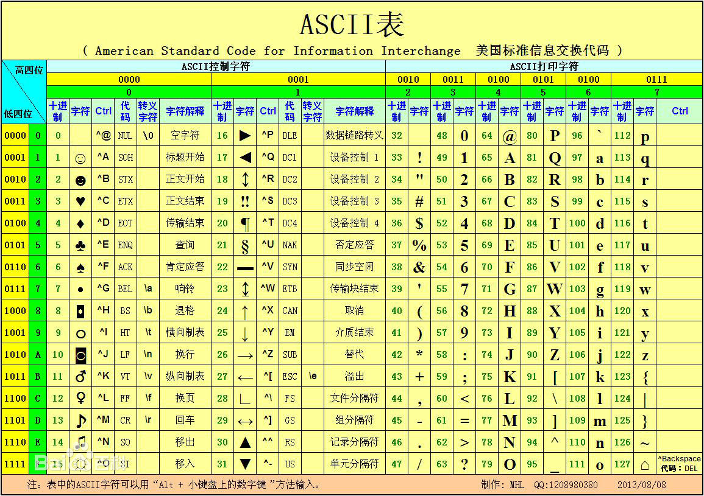

# 字符集与字符编码 #
  
字符 *Character* 是各种文字和符号的总称，包括各国家文字、标点符号、图形符号、数字等。也就是**符号，表示一定的意义。**  
字符集 *Character Set* 是多个字符的集合。**可以把不同的字符组合在一起，形成一个字符集。**比如，中国的汉字可以形成一个字符集。   
  
## 字符集 ##
  
字符集的种类较多，每个字符集包含的字符个数不同。常见的字符集有：  
* ASCII 字符集
* GB2312 字符集  
* BIG5 字符集  
* Unicode 字符集  
* ...  

当计算机要准确的处理各种字符集文字时，需要进行 **字符编码** ，以便计算机能够识别和存储各种文字。 
  
### ASCII ###
  
*ASCII (American Standard Code for Information Interchange), 美国信息互换标准编码* 是基于**罗马字母表**的一套电脑编码系统。  
  
**特点：**  
主要用于显示现代英语和其他**西欧**语言。它是现今最通用的 **单字节编码** 系统，等同于国际标准 *ISO 646* 。  
**包含内容：**  
* 控制字符：回车键、推个、换行符等。  
* 可显示字符：英文大小写字符、阿拉伯数字、西文符号。  
  

**技术特征：**  
7 *bit* 表示一个字符，共 128 字符，字符值从 0 到 127， 其中 32 —— 126 是可打印字符。   
**扩展字符集：**  
为了表示更多的欧洲常用字符，对 *ASCII* 字符集进行了扩展。其扩展字符集使用 8 *bit* 表示一个字符，共 256 个字符。  
*ASCII 扩展字符集* 是从 *ASCII 字符集* 扩充而来的，扩充后的符号增加了表格符号、计算符号、希腊字母和特殊的拉丁符号。  
  
  
### GB2312 ###
  
*GB2312* 又称为 *GB2312-80* 字符集，全称为《信息交换用汉字编码字符集.基本集》，由原中国国家标准总局发布。  
  
**特点：**  
*GB2312* 是中国国家标准的 **简体中文字符集** 。它收录的汉字覆盖 99.75% 的使用频率，基本满足了汉字的计算机处理需要。  
**包含内容：**  
*GB2312* 收录简体汉字以及一般符号、序号、数字、拉丁字母、日文假名、希腊字母、俄文字母、汉语拼音符号、汉语注音字母，共 7445 个图形符号。其中，包括 6763 个汉字。    

**技术特征：**  
1. 分区表示：  
*GB2312* 对汉字进行了 分区处理， **每区含有 94 个汉字、符号** 。这种表示方法也成为区位码。各区包含的字符如下：  
01-09 区为特殊符号， 16-55 区为一级汉字，按拼音排序， 56-87 区为二级汉字，按部首、笔画排序， 10-15 及 88-94 区没有编码。  
2. 双字节表示：  
两字字节中前面一个字节为 **第一字节**， 后面一个则为 **第二字节** 。习惯上称第一字节为高字节，第二字节为低字节。高字节使用 `0xA1-0xF7` (把 01-87 区的区号加上 `0xA0`), 低字节使用 `0xA1-0xFE` (把 01-94 加上 `0xA0`) 。  
  
### Unicode ###
  
*Unicode (Universal Multiple-Octet Coded Character Set) 字符集* 是通用多八位编码字符集，是由一个名为 *Unicode 学术学会* 的机构制定的字符编码系统，支持现今世界各种不同语言的书面文本的交换、处理及显示。  
  
**特征：**  
*Unicode* 为每种语言的每个字符设定了统一并且唯一的二进制编码，以满足跨语言、跨平台进行文本转换、处理的要求。  
**编码方法：**  
*Unicode* 标准始终使用十六进制数字，并且在书写的时候加上前缀 `U+` 。  
  
## 字符编码 ##
  
字符编码 *Character Encoding* 也成为字集码，是把字符集中的字符编码为指定集合中的某一个对象，以便文本在计算机中存储和传递。  
  
**参考资料:**
1. [百度百科](http://baike.baidu.com/link?url=ELcCAHQ0TOypDb5XrwXlHcOwP-Gd2lwckOReeF1pK2j-xT-wsozcdTx-vBShMRISIh05woxe7VtAfPfFDYMwQK)  
2. [可以参考](http://www.cnblogs.com/skynet/archive/2011/05/03/2035105.html#_3.1.UCS_&_UNICODE)