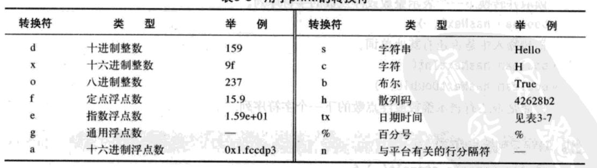
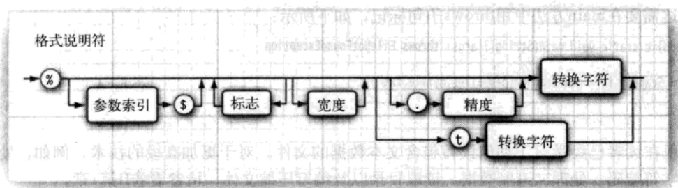

# 输入与输出 #
  
用于控制台的输入输出。  
 
## 读取输入 ##
  
要读取标准输入流，首先需要构建一个 `Scanner` 对象，并与标准输入流 `System.in` 关联。  
```Java
	Scanner in = new Scanner(System.in)
```  
之后，就可以使用 `Scanner` 类的各种方法实现输入操作。  
  
从控制台读取密码：  
```Java  
	Console cons = System.console();
	String username = cons.readLine("User name:");
	Char[] password = cons.readPassword("Password:");
```  
**注意：**为了安全起见，返回的密码存放在一维字符数组中，而不是存放在字符串中，因为字符串是不可变的。在对密码进行处理之后，应该马上用一个填充值覆盖数组元素，消除内存中的密码痕迹。  
采用 `Console` 对象每次只能读取一行输入，而没有能够读取一个单词会一个数值的方法。  
  
**java.uti.Scanner 的方法：**  
1. `Scanner(InputStream in)` --- 用给定的输入流创建一个 `Scanner` 对象。  
2. `String nextLine()` --- 读取输入的下一行内容。  
3. `String next()` --- 读取输入的下一个单词，以空格作为单词分隔符。  
4. `int nextInt()` --- 读取整数。  
5. `double nextDouble()` --- 读取浮点数。  
6. `boolean hasNext()` --- 检测输入中是否还有其他单词。  
7. `boolean hasNextInt()` ---  
8. `boolean hasNextDouble()` ---   

## 格式化输出 ##
  
`System.out.printf()`,用法类似*C*语言中的 `printf` 库函数。  
**转换符：**   
  
  
当需要对一个对象进行多次格式化时，可以使用**一个格式化的字符串指出要被格式化的参数索引。**索引必须紧跟在`%`后面，并以`$`终止。  
`System.out.printf("%1$s %2$tB %2$te,%2$tY", "Due date:", new Date());`  
其中，有 4 个格式化字符串，后面三个都是针对`new Date()` 。  
参数索引值从 1 开始， `%1$...` 表示对第一个参数格式刷。  
  
**格式说明符语法：**
  
  
## 文件输入与输出 ##
  
要对文件进行读取，需要用一个 `File` 对象构造一个 `Scanner` 对象，如：  
```Java  
	Scanner in = new Scanner(new File("file.txt"));
```  
如果文件名中包含反斜杠，就要在每个反斜杠之前加上一个额外的反斜杠，进行转义。  
要写入文件，就需要构造一个 `PrintWriter` 对象。在构造器中，只需提供文件名：  
```Java
	PrintWriter out = new PrintWriter("file.txt");
```  

